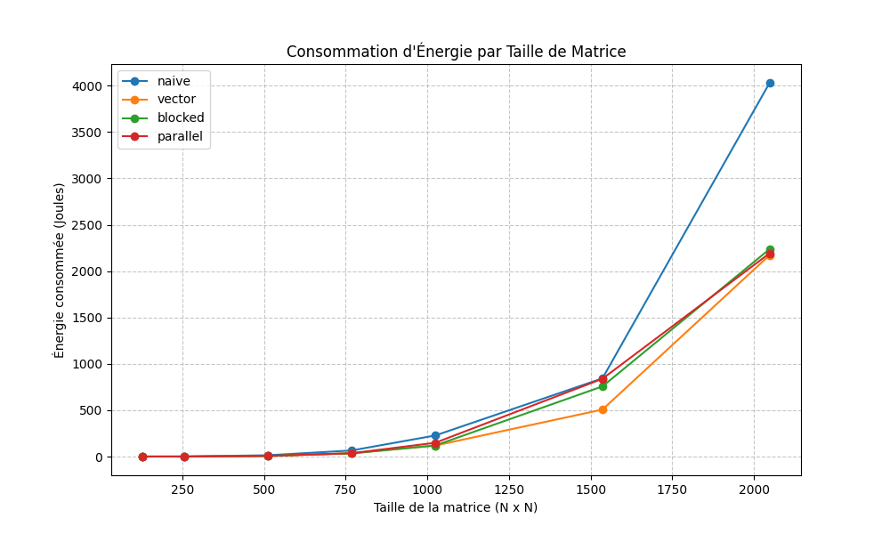

# État de l'Art : Efficacité Énergétique Logicielle

Ce document présente l'étude théorique préalable à l'implémentation de notre projet. Il s'appuie sur les références académiques et techniques fournies par l'encadrant.

## 1. Introduction et Enjeux
L'émergence de l'urgence climatique impose aujourd'hui une transformation profonde des pratiques de l'ingénierie logicielle, faisant de l'éco-conception un impératif technique plutôt qu'une simple option de performance. Alors que le secteur numérique représente une part croissante de la consommation électrique mondiale, le développement moderne doit désormais intégrer les enjeux environnementaux dès la phase de conception pour limiter l'empreinte matérielle et énergétique des services numériques. L'enjeu principal est d'optimiser l'efficacité énergétique, c'est-à-dire de réduire la quantité d'énergie nécessaire (exprimée en Joules) pour accomplir une tâche précise, appelée Unité Fonctionnelle.

En adoptant le langage Rust, ce projet s'inscrit dans une démarche de maîtrise fine du matériel, où chaque cycle CPU économisé et chaque accès à la mémoire vive (RAM) optimisé contribuent directement à l'amélioration du bilan énergétique global.

L'objectif scientifique de ce projet est d'analyser les mécanismes qui régissent la consommation énergétique logicielle en s'appuyant sur un cas d'étude concret : le calcul d'un produit matriciel. Cette approche permet de démontrer qu'à résultat identique, des choix d'implémentation et de gestion des ressources différents modifient radicalement la quantité de Joules consommés. Il s'agit d'établir une méthodologie permettant d'identifier le compromis optimal entre le temps d'exécution et la puissance électrique appelée, plaçant ainsi le développeur comme un acteur central de la sobriété numérique.

## 2. Méthodologie d'évaluation de la consommation énergétique
Dans ce chapitre, nous allons étudier comment mesurer et évaluer la consommation énergétique d'un programme lors de son exécution. Cette étape est indispensable car on ne peut pas savoir si un programme est bien optimisé sans le mesurer concrètement et voir combien il a réellement consommé.

Nous allons structurer cette étude en trois points : tout d'abord, nous comparerons la pertinence d'une mesure logicielle via LibreHardwareMonitor par rapport à une mesure physique. Ensuite, nous définirons un protocole d'isolation strict pour garantir que seule la consommation de notre application est comptabilisée. Enfin, nous détaillerons les métriques de calcul (Joules, Watts, Temps) qui nous permettront de quantifier l'efficacité énergétique de nos développements.

### 2.1 La Mesure : Physique vs Logicielle
Dans cette section, nous comparons deux approches pour quantifier la dépense énergétique d'un système informatique afin de justifier notre choix méthodologique.
* **La Mesure Physique (Wattmètre) :** Cette méthode consiste à placer un appareil de mesure entre la prise de courant et l'alimentation de l'ordinateur. Bien qu'elle donne la consommation réelle totale, elle manque de précision pour l'analyse logicielle car elle comptabilise l'ensemble des composants (écran, ventilateurs, périphériques USB, etc.), créant un "bruit" qui masque la consommation spécifique du programme étudié, rendant difficile l'isolation de l'impact réel du code.
* **La Mesure Logicielle (LibreHardwareMonitor) :** 
 Permet de mesurer spécifiquement :
  - la puissance CPU
  - la température
  - la charge CPU

 Nous utilisons **LibreHardwareMonitor** pour accéder aux données matérielles via un serveur local (`http://localhost:8085/data.json`).

### 2.2 Outils de Profilage et d’Analyse de Performance

Dans les environnements Linux, l’outil perf est largement utilisé pour l’analyse bas niveau des performances matérielles et logicielles. Perf est un outil de profilage intégré au noyau Linux permettant de mesurer différents événements matériels et logiciels pendant l’exécution d’un programme.

Perf s’appuie sur le PMU (Performance Monitoring Unit), un composant matériel intégré au processeur chargé de compter certains événements internes du CPU. Grâce à cette interface matérielle, il est possible d’observer avec précision le comportement du processeur et de la mémoire lors de l’exécution d’un algorithme.

Parmi les événements mesurables figurent notamment :

les cycles processeur (CPU cycles) ;
les instructions exécutées ;
les défauts de cache (cache misses) ;
les références cache (cache references) ;
les accès mémoire ;
certains indicateurs énergétiques via les compteurs RAPL des processeurs Intel.

Ces informations sont particulièrement importantes dans les études d’efficacité énergétique logicielle car elles permettent de relier directement les performances observées au comportement matériel du programme.

Dans le cadre de notre projet, les cache misses constituent un indicateur central. Lorsqu’une donnée n’est pas présente dans le cache du processeur, le CPU doit aller la récupérer dans la mémoire principale (RAM), beaucoup plus lente et plus coûteuse énergétiquement. Une augmentation du nombre de cache misses entraîne donc généralement :

cache misses ↑
→ accès RAM ↑
→ temps d’exécution ↑
→ énergie consommée ↑

Perf propose plusieurs commandes de profilage permettant d’analyser ces phénomènes :

perf stat : fournit des statistiques globales sur les événements matériels ;
perf record : enregistre les événements observés pendant l’exécution ;
perf report : analyse les données collectées ;
perf list : affiche les événements disponibles sur la machine ;
perf top : visualisation temps réel des fonctions les plus actives.

Par exemple, la commande suivante permet de mesurer le nombre de cache misses générés par un programme :

perf stat -e cache-misses ./programme

L’outil perf permet également d’accéder aux mesures énergétiques fournies par la technologie RAPL (Running Average Power Limit) intégrée dans certains processeurs Intel. Ces compteurs matériels permettent d’estimer la consommation énergétique du processeur pendant l’exécution d’un programme.

Dans le cadre de ce projet, nous n’avons pas utilisé directement perf car notre environnement expérimental principal était Windows. Nous avons donc privilégié l’utilisation de LibreHardwareMonitor
 afin d’accéder aux données énergétiques exposées par les compteurs RAPL via un serveur web local JSON.

Toutefois, un environnement Linux utilisant perf constituerait une extension naturelle du projet. Il permettrait d’obtenir une analyse plus fine des événements matériels internes du processeur et de corréler plus précisément les performances énergétiques observées avec les phénomènes de cache et de mémoire.

Sources
Documentation officielle perf Linux
Manuel perf – man7.org
Documentation Red Hat – perf
Article Wikipédia – perf Linux

### 2.3 Le Protocole d'Estimation (L'Isolation)
Pour obtenir des mesures fiables avec LibreHardwareMonitor, il est impératif de mettre en place un protocole d'isolation strict. L'objectif est de garantir que l'énergie consommée et mesurée provient exclusivement de l'exécution de notre algorithme et non de tâches de fond du système d'exploitation.
* **Nettoyage de l'environnement :** Avant chaque session de mesure, toutes les applications non essentielles (navigateurs web, outils de communication, mises à jour automatiques) doivent être fermées. Cela permet de réduire la sollicitation inutile du processeur et de la mémoire vive, limitant ainsi le "bruit" numérique qui pourrait fausser les résultats.
* **Établissement de la ligne de base (Idle) :** Une phase de repos de quelques minutes est observée avant de lancer le programme. Nous mesurons la consommation du système "à vide" pour identifier la consommation résiduelle inhérente à l'ordinateur. Cette valeur sert de référence pour isoler le surcoût énergétique lié uniquement à notre code.
* **Stabilité thermique :** Le processeur consomme davantage d'énergie lorsqu'il chauffe (phénomène de fuite de courant). Nous veillons donc à ce que la machine soit à une température stable entre chaque test pour éviter que la chaleur accumulée ne biaise les comparaisons.
* **Répétabilité et moyenne statistique :** Une mesure unique n'est jamais représentative à cause des micro-activités du système. Chaque test est répété plusieurs fois (par exemple 3 itérations). Nous calculons ensuite une moyenne des résultats afin d'assurer la validité statistique de nos données et d'éliminer les valeurs aberrantes.

### 2.4 Les Métriques de Calcul
Une fois le protocole de mesure appliqué, nous collectons des données quantitatives que nous analysons selon trois indicateurs complémentaires :
* **L'Énergie (Joules) :** C'est notre métrique de référence. Elle représente la quantité totale de travail électrique consommé par le processeur et la mémoire durant l'exécution complète de l'algorithme. C'est l'indicateur principal de l'empreinte environnementale du code.
* **La Puissance (Watts) :** Elle exprime le débit d'énergie à un instant $T$. Son analyse nous permet d'identifier les phases de calcul les plus intenses et d'observer les "pics" de consommation liés à certaines instructions ou accès mémoire.
* **Le Temps d'exécution (Secondes) :** Bien que l'objectif soit de réduire l'énergie, le temps reste une variable indissociable. Nous l'utilisons pour calculer l'efficacité énergétique globale, car un programme qui consomme peu de puissance mais met trop de temps à s'exécuter peut finalement présenter un bilan énergétique (en Joules) plus lourd qu'un programme rapide et intense.

## 3. Étude Algorithmique de la Multiplication de Matrices
### 3.1 Définition mathématique
Soient deux matrices :
A de taille n × p
B de taille p × m
Le produit matriciel C = A × B est défini par :
C[i][j] = Σ A[i][k] × B[k][j]
Cette opération nécessite un grand nombre de calculs arithmétiques et d'accès mémoire, ce qui en fait un cas d'étude pertinent pour analyser la consommation énergétique.

### 3.2 Algorithme naïf
L'algorithme classique repose sur trois boucles imbriquées :
Première boucle : lignes de A
Deuxième boucle : colonnes de B
Troisième boucle : somme des produits
La complexité temporelle est :
O(n³)
Cette complexité implique un grand nombre d'opérations lorsque la taille des matrices augmente. Concrètement, doubler la taille n multiplie le nombre d'opérations par 8, ce qui se traduit directement par une augmentation cubique du temps d'exécution — et donc de l'énergie consommée.

### 3.3 Impact de l'ordre des boucles sur la mémoire
L'ordre des boucles influence fortement :
la localité mémoire
l'utilisation du cache CPU
le nombre d'accès à la RAM
Un mauvais ordre peut provoquer davantage de cache misses, augmentant ainsi la consommation énergétique.
Cette observation montre que deux implémentations mathématiquement équivalentes peuvent avoir des comportements énergétiques très différents.

### 3.4 Les quatre variantes implémentées

Dans ce projet, quatre variantes du produit matriciel ont été implémentées en Rust :

* **Naïve (i, j, k) :** L'ordre naturel des boucles. L'accès à `B[k][j]` génère de nombreux cache misses car la matrice B est parcourue colonne par colonne, contrairement à son stockage en mémoire qui est ligne par ligne (row-major).

* **Vectorisée (i, k, j) :** Un simple réordonnancement des boucles. En fixant `k` avant `j`, la valeur `A[i][k]` est lue une seule fois et réutilisée pour toute la ligne de B, maximisant ainsi la localité spatiale et permettant au compilateur de vectoriser les accès.

* **Blocked / Tiling :** Découpe les matrices en blocs de taille fixe (64 dans notre implémentation). L'objectif est de faire tenir les blocs actifs dans le cache L1/L2 du processeur, réduisant drastiquement les accès à la RAM.

* **Parallèle (Rayon) :** Exploite les cœurs multiples du processeur via la bibliothèque Rayon. Chaque ligne de la matrice résultante est calculée indépendamment sur un thread distinct.

## 4. Complexité et Consommation Énergétique
La consommation énergétique d'un programme dépend de la relation suivante :
Énergie (Joules) = Puissance (Watts) × Temps (secondes)
Un algorithme plus rapide réduit généralement le temps d'exécution, mais peut augmenter la puissance instantanée du processeur.
L'objectif est donc de trouver un compromis optimal entre performance et consommation électrique.

La complexité O(n³) de la multiplication matricielle implique que l'énergie théorique évolue également en O(n³) si la puissance instantanée reste constante. En pratique, les effets de cache et la parallélisation modifient ce comportement, mais la tendance cubique reste observable expérimentalement, comme le confirment nos mesures.

## 5. Second Cas d'Étude : L'Algorithme de Fibonacci

En complément de l'étude matricielle, trois implémentations de l'algorithme de Fibonacci ont été développées : une version naïve récursive (complexité exponentielle O(2^n)), une version itérative (O(n)) et une version avec mémoïsation (O(n)). Ce second cas permet d'illustrer l'impact de la redondance des calculs sur la consommation énergétique, dans un contexte différent de la multiplication de matrices : ici, le goulot d'étranglement est algorithmique (recalculs inutiles) plutôt que lié à la gestion mémoire. Comme attendu, la version naïve s'avère nettement plus coûteuse en temps et en énergie, confirmant sur un second exemple que le choix d'implémentation influe directement sur l'efficacité énergétique.

## 6. Synthèse

Cette étude théorique met en évidence que la consommation énergétique d'un programme dépend des choix algorithmiques, de l'implémentation, de la gestion mémoire et de l'interaction avec l'architecture matérielle.

Dans le cadre de ce projet, nous avons appliqué ces principes à la multiplication matricielle en Rust, en comparant quatre variantes allant de l'implémentation naïve à la version parallèle multi-cœurs. Les mesures ont été réalisées avec LibreHardwareMonitor sur plusieurs tailles de matrices (de 128×128 à 2048×2048) afin d'observer l'évolution de la consommation énergétique en fonction de la taille du problème et de l'algorithme utilisé. Cette approche expérimentale permet de quantifier concrètement les gains énergétiques obtenus grâce à des optimisations de localité mémoire et de parallélisme.

## 7. Mesure de la Consommation Énergétique (Windows Native)

Nous avons effectué les mesures énergétiques directement sous Windows en utilisant
LibreHardwareMonitor, qui permet d'accéder aux capteurs matériels du processeur via un serveur web local.

### 7.1 Infrastructure de Mesure

**Technologie RAPL (Running Average Power Limit)**

Le processeur Intel Core i5-1145G7 embarque des compteurs matériels intégrés appelés
RAPL qui mesurent la consommation électrique réelle du CPU en temps réel, directement
depuis les registres internes du processeur (MSR registers).

**Outil : LibreHardwareMonitor**

Dans le cadre de ce projet, nous avons étudié l'outil **LibreHardwareMonitor** afin de mieux comprendre les possibilités offertes pour l'analyse du comportement matériel d'un programme.

LibreHardwareMonitor est un logiciel libre de monitoring matériel. D'après les informations consultées, il permet de surveiller plusieurs types d'indicateurs en temps réel, notamment :

- les **températures**
- les **vitesses des ventilateurs**
- les **tensions**
- la **charge** du système
- les **fréquences d'horloge**

L'outil peut lire des informations sur plusieurs composants matériels, par exemple :

- les **cartes mères**
- les **processeurs Intel et AMD**
- les **cartes graphiques NVIDIA, AMD et Intel**
- les **disques HDD, SSD et NVMe**
- les **cartes réseau**

Nous utilisons LibreHardwareMonitor sous Windows, avec son **serveur web local** qui expose les données sous forme JSON. Cela permet à notre script Python de récupérer automatiquement les mesures nécessaires pendant l'exécution des programmes Rust.

Enfin, LibreHardwareMonitor propose également une bibliothèque nommée **LibreHardwareMonitorLib**, qui permet d'intégrer directement ses fonctionnalités dans une application. Cela représente une piste intéressante pour des extensions futures du projet.

Les informations sur LibreHardwareMonitor ont été obtenues à partir du dépôt officiel GitHub :
https://github.com/LibreHardwareMonitor/LibreHardwareMonitor

Pour accéder aux données RAPL sous Windows, nous avons utilisé
[LibreHardwareMonitor](https://github.com/LibreHardwareMonitor/LibreHardwareMonitor),
un logiciel open-source qui :
1. Accède aux registres matériels du CPU en mode administrateur
2. Lit les valeurs RAPL en temps réel
3. Les expose via un serveur web local sur `http://localhost:8085/data.json`

### 7.2 Méthodologie de Mesure

**Principe : échantillonnage + intégration trapézoïdale**

La puissance CPU n'est pas constante pendant l'exécution d'un benchmark — elle varie
selon la charge. Il est donc impossible d'utiliser une valeur fixe. Notre script Python
adopte l'approche suivante :

1. **Lancer le binaire Rust en arrière-plan** via `subprocess.Popen()`
2. **Échantillonner la puissance** toutes les 50ms en interrogeant LibreHardwareMonitor
   pendant toute la durée d'exécution
3. **Calculer l'énergie** par intégration trapézoïdale :

$$E = \sum_{i=1}^{n} \frac{P_i + P_{i-1}}{2} \times \Delta t_i$$

où $P_i$ est la puissance en Watts à l'instant $t_i$ et $\Delta t_i$ est l'intervalle
entre deux échantillons consécutifs. Le résultat est exprimé en **Joules**.

Chaque version a été exécutée **3 fois** sur des matrices de tailles 128×128, 256×256, 512×512, 768×768, 1024×1024, 1536×1536 et 2048×2048, et la moyenne est retenue afin de réduire le bruit de mesure dû aux processus système en arrière-plan (OS, antivirus, etc.).

### 7.3 Résultats Énergétiques

Les mesures ont été réalisées sur 7 tailles de matrices (128×128 à 2048×2048),
chaque version étant exécutée 3 fois et la moyenne retenue.

| Taille | Naïve (J) | Vectorisée (J) | Blocked (J) | Parallèle (J) |
| :----- | :-------: | :------------: | :---------: | :-----------: |
| 128×128   |    0.11   |      0.29      |     0.36    |      0.41     |
| 256×256   |    0.61   |      0.47      |     0.18    |      0.36     |
| 512×512   |    7.57   |      2.47      |     3.46    |      2.24     |
| 768×768   |   25.66   |     11.47      |    11.56    |     12.41     |
| 1024×1024 |  185.93   |     91.27      |    91.93    |     89.70     |
| 1536×1536 |  643.46   |    321.84      |   332.49    |    369.04     |
| 2048×2048 | 2015.65   |    994.91      |   974.25    |    985.89     |

### 7.4 Analyse

#### Comportement à petite taille (n = 128–256) : l'inversion paradoxale

Pour n = 128, la version naïve est paradoxalement la plus économe (0.11 J contre
0.41 J pour la parallèle). Ce phénomène s'explique par le fait que pour de très
petites matrices, les données tiennent entièrement dans le cache L1 du processeur —
les cache misses sont quasi inexistants pour toutes les versions. Dans ce contexte,
le surcoût lié à la gestion du parallélisme (création et synchronisation des threads
via Rayon) et à la gestion des blocs (tiling) dépasse le bénéfice apporté. La version
naïve, plus simple, s'avère alors la plus légère.

À n = 256, on observe une première inversion : la version blocked devient la plus
efficace (0.18 J), devant la naïve (0.61 J). Le tiling commence à tirer parti de la
localité cache même pour de petites matrices, tandis que la naïve commence à
rencontrer ses premiers défauts de cache.

#### Amorce de la divergence (n = 512–768)

À partir de n = 512, la version naïve commence à subir l'effet des cache misses de
façon visible : elle consomme 7.57 J contre 2.24–3.46 J pour les versions optimisées,
soit un écart d'un facteur 2 à 3. Son accès à la matrice B colonne par colonne provoque
des défauts de cache de plus en plus fréquents à mesure que la matrice dépasse la
capacité des niveaux de cache supérieurs.

À n = 768, les trois versions optimisées présentent des consommations très proches
(11.47, 11.56 et 12.41 J) tandis que la naïve atteint déjà 25.66 J — soit environ
le double. La divergence s'installe durablement.

#### Rupture nette à partir de n = 1024

À n = 1024, la version naïve consomme 185.93 J, soit environ le double des versions
optimisées (89.70–91.93 J). La croissance cubique O(n³) se confirme
expérimentalement mais avec une amplification supplémentaire pour la version naïve :
de n = 512 à n = 1024 (facteur ×2 en taille), la naïve passe de 7.57 J à 185.93 J
(facteur ×24), bien au-delà du facteur ×8 théorique. L'explosion des cache misses
amplifie donc la croissance cubique pour l'algorithme le moins adapté à l'architecture
mémoire.

#### Convergence des versions optimisées aux grandes tailles (n = 1536–2048)

À n = 1536 et n = 2048, les trois versions optimisées convergent vers des
consommations quasi-identiques : à n = 2048, vectorisée (994.91 J), blocked
(974.25 J) et parallèle (985.89 J) sont séparées de moins de 2 %. Ce plafonnement
commun indique que les trois stratégies atteignent la même limite matérielle : la
bande passante mémoire du processeur. Aucune optimisation logicielle supplémentaire
ne peut dépasser ce seuil sans changer de matériel.

La puissance instantanée, elle, reste remarquablement stable pour toutes les versions
sur ces grandes tailles (≈ 5.6–6.5 W), ce qui confirme une nouvelle fois que c'est
le temps d'exécution — et non la puissance instantanée — qui détermine l'énergie
finale consommée.

#### Le principe fondamental confirmé

La version naïve à n = 1024 consomme 6.09 W en moyenne contre 6.48–6.66 W pour les
versions optimisées — une puissance instantanée légèrement *inférieure* — et pourtant
elle consomme deux fois plus d'énergie. Ce résultat contredit l'intuition initiale
selon laquelle un programme "moins actif" serait plus économe :

> *E = P × t : à puissance quasi-égale, c'est le temps d'exécution qui détermine
> la consommation énergétique totale.*

L'écart énergétique entre la version naïve et les versions optimisées n'est pas
constant — il s'amplifie avec n. Cela signifie que les bonnes pratiques
d'implémentation (localité mémoire, parallélisme) sont d'autant plus importantes
que la taille du problème est grande.